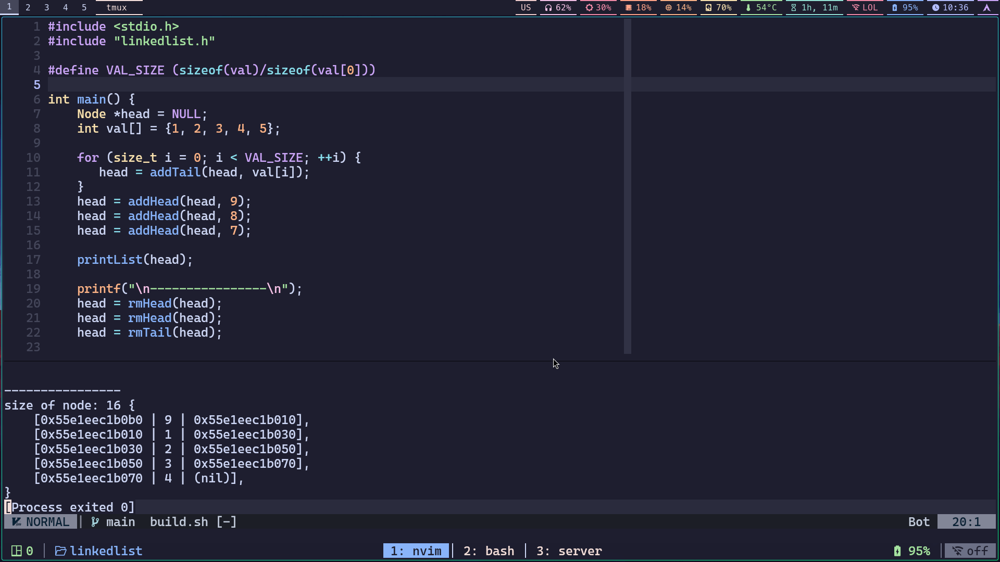

# My Project
### I install a default yasb > get theme and change it to fit my need.
- No 1

- No 2

- No 3

- No 4

## Alacritty 
- Currenty for Windows 
## Nvim 
- Nvim config is for Linux or Wsl 

- Ref of my Tmux, Waybar, Hyprland, Nvim(nvim-pack)

